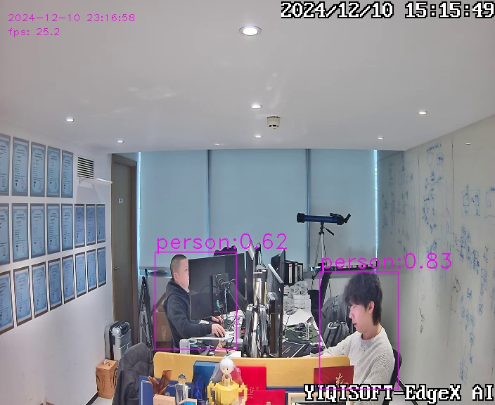
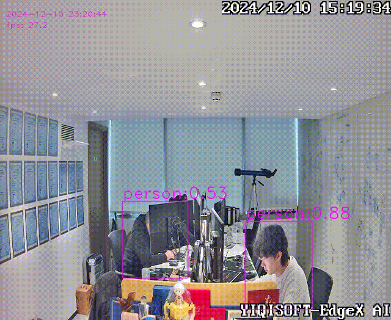

# Overview

This is a demo for [OpenVINO Model Server](https://github.com/openvinotoolkit/model_server) powered by [EdgeX](https://github.com/edgexfoundry/edgex-go) device service.

# Prerequisites

EdgeX
- [EdgeX Device Service SDK](https://docs.edgexfoundry.org/latest/microservices/device/Ch-DeviceServices/) is a Go library for EdgeX device services.

Third party
- [OpenVINO](https://docs.openvino.ai/latest/openvino_docs_install_guides_installing_openvino_linux.html) is a toolkit for neural network optimization for Intel® hardware.
- [OpenVINO Model Server](https://github.com/openvinotoolkit/model_server) is a model serving framework for OpenVINO™ toolkit.
- [Gocv](https://github.com/hybridgroup/gocv) is a Go package for computer vision using OpenCV 4 and beyond.


# Documentation

For latest documentation please visit https://docs.edgexfoundry.org/

# Features

- [x] An Object Detection model ([ssdlite_mobilenet_v2](https://docs.openvino.ai/2023.3/omz_models_model_ssdlite_mobilenet_v2.html)) embedded in a demo device service
- [x] Support multiple models. If other models share the same input and output format as this one, you can use this demo to perform inference on them. See [Model Metadata](#step-4-check-ovms-running) for more details.
- [x] Support multiple inference devices(CPU, GPU, NPU) by intel
- [x] Support multiple devices in one device service
- [x] Support local model server and remote model server, specified by device protocol

# Usage

## Install deps

## OpenVINO Model Server (OVMS)

### Step 1: Prepare Docker

Please refer the OVMS [Quickstart Guide](https://docs.openvino.ai/2024/openvino-workflow/model-server/ovms_docs_quick_start_guide.html)

### Step 2: Provide a Model

This demo uses [ssdlite_mobilenet_v2](https://docs.openvino.ai/2023.3/omz_models_model_ssdlite_mobilenet_v2.html) model.

```shell
model
└── 1
    ├── coco_91cl_bkgr.txt
    ├── ssdlite_mobilenet_v2.bin
    ├── ssdlite_mobilenet_v2.mapping
    └── ssdlite_mobilenet_v2.xml
```
### Step 3: Start the Model Server Container
Start the container:

- using CPU for inference 
```shell
docker run -d -u $(id -u) --rm \
-v ${PWD}/model:/model \
-p 9000:9000 -p 8000:8000 \
openvino/model_server:latest \
--model_name ssd \
--model_path /model \
--port 9000 \
--rest_port 8000
```

- using GPU for inference
```shell
docker run -d -u $(id -u) --rm \
--privileged \
-v ${PWD}/model:/model -v /dev/dri:/dev/dri \
-p 9000:9000 -p 8000:8000 \
openvino/model_server:latest \
--model_name ssd \
--model_path /model \
--port 9000 \
--rest_port 8000 \
--target_device GPU
```


### Step 4: Check OVMS running

```shell
curl http://localhost:8000/v1/config
```

```json
{
  "faster_rcnn": {
    "model_version_status": [
      {
        "version": "1",
        "state": "AVAILABLE",
        "status": {
          "error_code": "OK",
          "error_message": "OK"
        }
      }
    ]
  }
}
```

```shell
curl http://localhost:8000/v1/models/ssd/metadata
```

```json
{
  "modelSpec": {
    "name": "ssd",
    "signatureName": "",
    "version": "1"
  },
  "metadata": {
    "signature_def": {
      "@type": "type.googleapis.com/tensorflow.serving.SignatureDefMap",
      "signatureDef": {
        "serving_default": {
          "inputs": {
            "image_tensor": {
              "dtype": "DT_UINT8",
              "tensorShape": {
                "dim": [
                  {
                    "size": "1",
                    "name": ""
                  },
                  {
                    "size": "300",
                    "name": ""
                  },
                  {
                    "size": "300",
                    "name": ""
                  },
                  {
                    "size": "3",
                    "name": ""
                  }
                ],
                "unknownRank": false
              },
              "name": "image_tensor"
            }
          },
          "outputs": {
            "detection_boxes": {
              "dtype": "DT_FLOAT",
              "tensorShape": {
                "dim": [
                  {
                    "size": "1",
                    "name": ""
                  },
                  {
                    "size": "1",
                    "name": ""
                  },
                  {
                    "size": "100",
                    "name": ""
                  },
                  {
                    "size": "7",
                    "name": ""
                  }
                ],
                "unknownRank": false
              },
              "name": "detection_boxes"
            }
          },
          "methodName": "",
          "defaults": {

          }
        }
      }
    }
  }
}
```

### Install Gocv

Install Gocv and its dependencies.
```
git clone https://github.com/hybridgroup/gocv.git
cd gocv
make install
```

## Build and Run the demo

Build the demo
```shell
make build
```

Run the demo

```shell
make run
```

## Result preview

There is an live link in the demo device service that you can use to check the inference result online.

The link format is: http://[hostname]:18080/[device-name].mjpeg, such as http://localhost:18080/Simple-OpenVINO-Device.mjpeg in this demo.

- Snapshot:



- Video:



[Inference Reuslt Video Clip](./docs/output.mp4)

## Reference

- [Gocv](https://github.com/hybridgroup/gocv)

# License

[Apache-2.0](LICENSE)